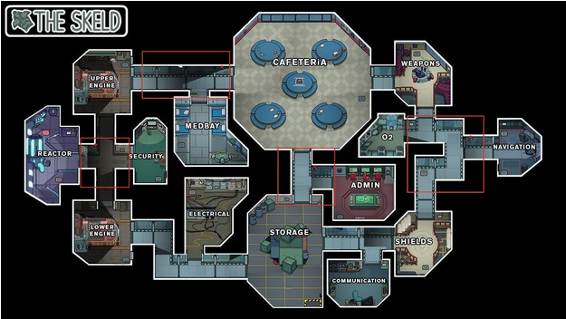
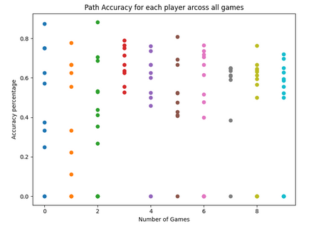
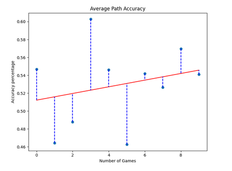
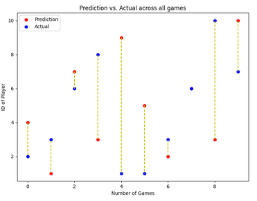

# [Among AI](https://github.com/calebcscott/among-ai)

## Background
This project is a heavily abstracted version of the game *Among Us* where an AI player is present in the game monitoring the cameras. Graph structure used and camera placements match the Skeld map of the game.

The goal of the game was to develop an AI that could accurately predict the killer based on the limited time series data. Due to unique nature of the project and no previous dataset being created, this project contains a small and niave approach to generate game data that can then be processed by the AI. The link to the paper for the project can be found [here](https://docs.google.com/document/d/1z2yQikTufBIRZ88F1eqUclwT98NqOBxu4Biik7VAwJ8/edit?usp=sharing)

## How To

Note: All information on how to run the files explained in the floowing steps can be found in the [Files](#Files) section below.

 1. First to run the program, you will need to write your own node and edge file similar to the nodes and edges files in the project they follow the format, with no spaces between the commas:
    - Nodes.txt
        > Node name,Camera boolean
    - edges.txt
        > Node name,Node name,edge weight
2. Next Need to generate the game data using the [test.py](#Files), if wanting to run analysis/generate metric output make sure to use the *--all* flag
3. Run the AI against the json file output from the previous step using [amongAI.py](#Files)
4. Optional, Run the metric analysis on the *\*-metrics.json* file produced in the previous step. Sample output is displyed below:

### Sample path accuracy output

### Sample average path accuracy output

### Sample predicted vs. actual output

## Files

- amongAI.py - Main  AI file used to perform analysis on game data generated by *test.py*, also outputs a metric file and accuracy information
    > python amongAI.py \[./game_data\]
- test.py - Runs the simulation of the game and generates the game data files for *amongAI.py*, default output is the limited game time series data, can specify output of all events with *--all* switch(required if using *metrics\.py*)
    > python test.py ./nodes_file.txt ./edges_file.txt ./ouput_file_prefix num_of_players num_of_games [buffer, --all]
- simulation.py - library classes to facilitate use of using/loading graph structure
- pathfinder.py - library to create state space search, modify graph nodes to facilitate use of *A** algorithm, facilitate path joinings, output prediction
- metrics.py - Uses *\*-all-events.json* file from *test.py* and *\*-metrics.json* file from *amongAI.py* to output metric several metric information/analysis.
    > python metric.py ./metric.json
